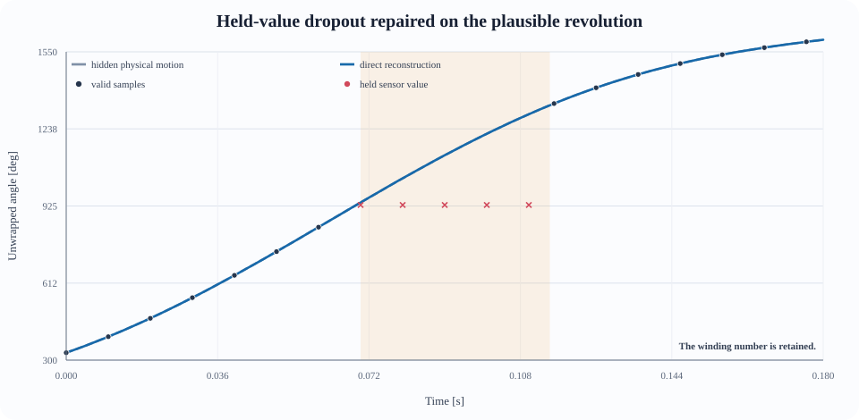
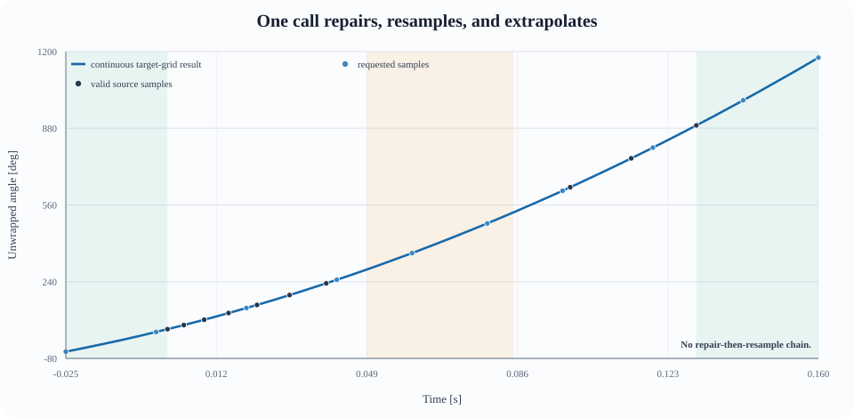

# circular_interpolation

Robust reconstruction of circular signals with dropouts, wraparound, held sensor values, and optional direct evaluation on a different time grid. The same reconstruction pipeline can also be used for ordinary non-periodic scalar signals.



Angles are not ordinary scalars: `359 deg` and `1 deg` are two degrees apart, and a gap may hide complete revolutions. The package keeps an unwrapped trajectory internally and wraps only the final output. For non-circular data, pass `period=None` and no wrap or unwrap operation is performed.

## Highlights

- **Automatic gap model selection** for standstill, short dynamic gaps, and longer moving gaps.
- **Winding-aware reconstruction** that can retain the likely number of full revolutions.
- **Non-circular mode:** `period=None` disables all branch alignment, wrapping, and unwrapping.
- **One optional resampling kwarg:** `target_time_s`.
- **Direct target-grid evaluation:** selected continuous trajectories are evaluated at the requested times instead of repairing a wrapped series and then resampling it.
- **Irregular grids and extrapolation** are supported.
- **Raw-stream wrapper** detects held-value plateaus while conservatively preserving real standstill and quantization plateaus.
- **Measured plateau anchors stay valid by default:** only subsequent stale repetitions are reconstructed.
- **Optional repair-duration guard:** long detected plateaus can be preserved even when ambiguous plateaus are repaired aggressively.
- **Diagnostics** report the selected model and confidence for each source gap.

## Installation

```bash
pip install -e .
```

Python 3.9 or newer is required. Runtime dependencies are NumPy, SciPy, and Matplotlib.

## Recommended API: known invalid samples

Use `interpolate_circular_auto` when a CRC flag, missing value, quality channel, or another detector already tells you which source samples are invalid.

```python
import numpy as np
from circular_interpolation import interpolate_circular_auto

# Wrapped source measurements in degrees.
time_s = np.array([0.000, 0.010, 0.020, 0.030, 0.040])
angle_deg = np.array([350.0, 357.0, np.nan, 11.0, 18.0])
invalid_mask = ~np.isfinite(angle_deg)

result = interpolate_circular_auto(
    time_s=time_s,
    angle_deg=angle_deg,
    invalid_mask=invalid_mask,
)

print(result.time_s)        # Same as time_s by default.
print(result.angle_deg)     # Wrapped to [0, 360).
print(result.unwrapped_deg) # Continuous physical branch.
print(result.chosen_model_by_gap)
print(result.confidence_by_gap)
```

Omitting `target_time_s` preserves the source grid. Omitting `period` preserves the historical circular behavior with a period of `360.0`.

## Repair and change the time grid in one call

Pass any finite, strictly increasing one-dimensional grid. It may be denser, sparser, irregular, shifted, or extend outside the measured time span.

```python
new_time_s = np.linspace(-0.005, 0.050, 500)

result = interpolate_circular_auto(
    time_s=time_s,
    angle_deg=angle_deg,
    invalid_mask=invalid_mask,
    target_time_s=new_time_s,
)

assert np.array_equal(result.time_s, new_time_s)
assert result.angle_deg.shape == new_time_s.shape
assert result.unwrapped_deg.shape == new_time_s.shape
```



The target-grid path does not interpolate already wrapped repaired values. It works on the selected continuous trajectories:

1. Valid source runs are assigned to consistent revolutions in circular mode.
2. Each internal gap receives the same automatic model as on the source grid.
3. That continuous model is evaluated directly for target timestamps inside the gap. Linear and Hermite gaps use their analytic curves; short Kalman/RTS gaps insert the requested times as prediction-only states in the same state-space model.
4. Valid runs use shape-preserving interpolation on the continuous branch.
5. Outside the measured support, local boundary position, velocity, and acceleration are estimated. Acceleration is applied only over the local fitting horizon; farther extrapolation continues at constant velocity to avoid unbounded quadratic growth.

Extrapolation is necessarily less certain than interpolation between measurements, especially across reversals or abrupt control changes. Keep extrapolation horizons physically reasonable for the application.

## Non-circular signals

Use `period=None` for an ordinary scalar signal. This is the Pythonic sentinel for “there is no period”; using `np.inf` would leave modulo and nearest-branch formulas operating on a mathematical special value, so infinite periods are rejected deliberately.

```python
values = np.array([340.0, 350.0, np.nan, 10.0, 20.0])
invalid_mask = ~np.isfinite(values)

result = interpolate_circular_auto(
    time_s=np.arange(values.size, dtype=float),
    angle_deg=values,
    invalid_mask=invalid_mask,
    period=None,
)

# Ordinary interpolation: halfway between 350 and 10 is 180, not 0.
assert np.isclose(result.angle_deg[2], 180.0)
assert np.array_equal(result.angle_deg, result.unwrapped_deg)
```

With `period=None`:

- differences use ordinary subtraction;
- valid runs are not unwrapped;
- gap endpoints are not shifted by whole revolutions;
- results are not reduced modulo a period;
- `angle_deg` and `unwrapped_deg` contain the same values.

The historical names `angle_deg` and `unwrapped_deg` are retained for API compatibility even when the signal uses another unit.

## Raw stream processing

Use `interpolate_raw_circular_stream` when the sensor repeats its last value instead of supplying an explicit invalid flag. The classifier uses two-sided motion evidence and physical acceleration limits to separate likely held-value dropouts from true standstill, sensor quantization, and ambiguous reversals.

```python
from circular_interpolation import interpolate_raw_circular_stream

raw_result = interpolate_raw_circular_stream(
    time_s=time_s,
    angle_deg=angle_deg,
)

print(raw_result.angle_deg)
print(raw_result.decisions)
print(raw_result.repaired_mask)
```

The same detector works for non-circular data:

```python
raw_result = interpolate_raw_circular_stream(
    time_s=time_s,
    angle_deg=ordinary_values,
    period=None,
)
```

### The first plateau value remains valid by default

When a repeated plateau is classified as a held-value dropout, its first occurrence is treated as a genuine measurement. Only the later repetitions are reconstructed:

```text
input:       [1, 2, 3, 3, 3, 3, 7, 8, 9]
repair mask: [., ., ., x, x, x, ., ., .]
model sees:  [1, 2, 3, ?, ?, ?, 7, 8, 9]
```

The first `3` did not appear from thin air: the sensor measured it before it began returning that stale value. This is the default `plateau_anchor_policy="preserve"` behavior.

For a sensor protocol where the first occurrence may already be stale, include it explicitly:

```python
raw_result = interpolate_raw_circular_stream(
    time_s=time_s,
    angle_deg=angle_deg,
    plateau_anchor_policy="repair",
)
```

This changes only which samples enter the reconstruction mask. Plateau classification and its source-index diagnostics remain unchanged.

### Safety when repairing ambiguous plateaus

`ambiguous_policy="repair"` is useful when small real dropouts would otherwise be left untouched, but it is intentionally aggressive. From values alone, a genuine internal standstill and a sensor that holds its last value are not identifiable in every case.

Leading and trailing plateaus are already protected. They are classified as `boundary_plateau` and remain exact sensor values even when ambiguous plateaus are repaired. For internal plateaus, use a duration guard when the acquisition protocol provides a plausible maximum dropout length:

```python
raw_result = interpolate_raw_circular_stream(
    time_s=time_s,
    angle_deg=angle_deg,
    ambiguous_policy="repair",
    max_plateau_repair_duration_s=0.020,
)
```

In this example, automatically detected plateaus longer than 20 ms are preserved. The limit applies to both `ambiguous` and `held_dropout` decisions because a true standstill can be misclassified as either one. Explicit `NaN` or infinite samples are still repaired because their invalidity is known rather than inferred.

Choose the value from the sensor or transport contract, for example the largest credible packet-loss burst. `None`, the default, keeps the previous unlimited behavior. A decision that was blocked by the limit retains its original kind and receives an explanatory suffix in `decision.reason`; `repaired_mask` always reflects the samples that were actually reconstructed.

Run the synthetic stop-go benchmark with:

```bash
PYTHONPATH=src python benchmarks/standstill_safety.py
```

It exercises ramp-up, ramp-down, an internal standstill, a second motion cycle, and a trailing standstill across several speeds and durations. It reports how often the internal standstill was modified, the resulting maximum error, and confirms that boundary plateaus stay untouched.

The raw-stream wrapper deliberately keeps its classification masks and output on the sensor grid. To produce a different output grid after classification, call the automatic API with the detected mask:

```python
resampled = interpolate_circular_auto(
    time_s=time_s,
    angle_deg=angle_deg,
    invalid_mask=raw_result.repaired_mask,
    target_time_s=new_time_s,
)
```

`target_time_s` belongs to interpolation; plateau classification continues to describe the original samples.

## Automatic model selection

For each internal source gap, `interpolate_circular_auto` currently applies these empirical rules from the motor-profile test suite:

| Situation | Selected model |
|---|---|
| Near standstill | Shortest-arc linear trajectory (`linear` when `period=None`) |
| Moving, endpoint-to-endpoint gap at most 6 ms | Constant-acceleration Kalman/RTS trajectory |
| Longer moving gap | Boundary-velocity cubic Hermite trajectory |
| Leading or trailing missing source samples | Boundary kinematic extrapolation |

Long dynamic gaps are reconstructed but may receive medium or low confidence when boundary velocities disagree strongly or change direction.

## Lower-level algorithms

The lower-level functions remain available for experiments and applications that deliberately choose a fixed circular model:

```python
from circular_interpolation import (
    interpolate_circular_inertial,
    interpolate_circular_adaptive_minimum_jerk,
)
```

- `interpolate_circular_inertial`: constant-velocity Kalman filter with stochastic acceleration and an RTS backward pass.
- `interpolate_circular_adaptive_minimum_jerk`: winding search plus a smooth minimum-jerk correction with an exact linear fallback.

These lower-level public APIs return values on the source grid and remain circular. Direct `target_time_s` evaluation and `period=None` are exposed by the recommended automatic and raw-stream functions, where model selection and output-grid semantics remain consistent.

## Result semantics

- `time_s`: timestamps corresponding to both output signal arrays.
- `angle_deg`: wrapped output in `[0, period)` when `period` is finite; ordinary unbounded output when `period=None`.
- `unwrapped_deg`: continuous branch retaining complete revolutions; identical to `angle_deg` when `period=None`.
- `chosen_model_by_gap`: `(start, end, model)` tuples using **source indices**; `end` is exclusive.
- `confidence_by_gap`: source-index ranges with `high`, `medium`, or `low` confidence.

The configurable `period` defaults to `360.0`. Pass `None` to disable periodic handling. Finite positive periods other than 360 are supported; zero, negative, non-finite, and infinite periods are rejected.

## Development

Run the focused test suite:

```bash
pytest -q
```

Regenerate the README figures:

```bash
PYTHONPATH=src python docs/generate_readme_plots.py
```

Repository layout:

- `src/circular_interpolation/`: interpolation algorithms and wrappers.
- `tests/`: deterministic unit tests.
- `benchmarks/`: fixed motor-profile corpus and evaluation scripts.
- `docs/`: reproducible README figures.
